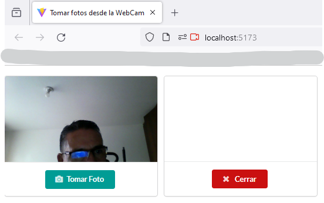
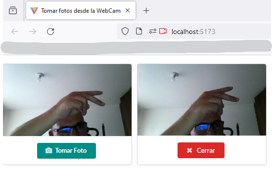

# Tomar fotos desde la WebCam
## React + Vite

Este desarrollo web es un ejercicio de práctica para mejorar las habilidades en React mediante el uso de los dispositivos del PC.

Usando @vitejs

Desarrollado por Wilson Rios V.
